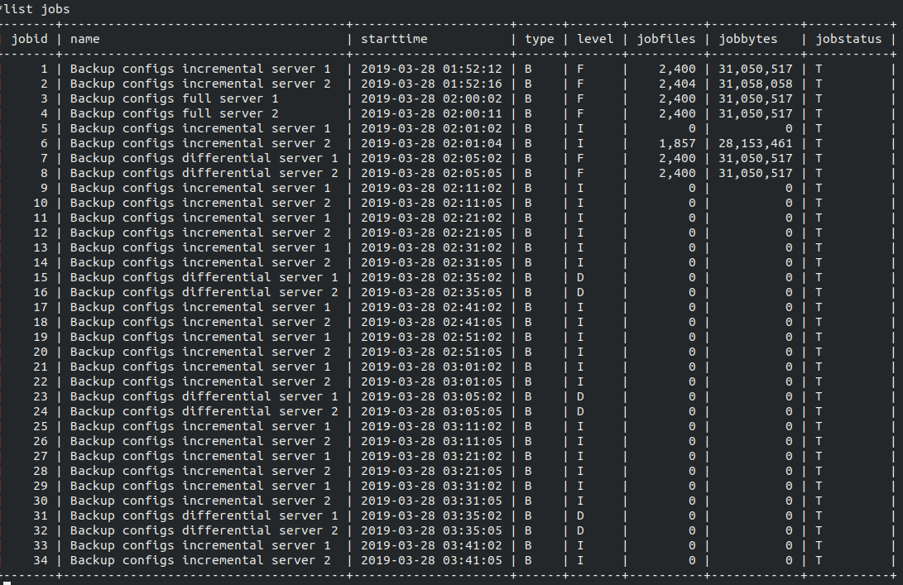
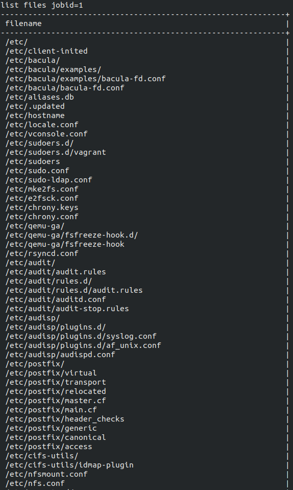

# Backups

## Homework
Настраиваем Backup
Настроить стенд Vagrant с двумя виртуальными машинами server и client.

Настроить политику бэкапа директории /etc с клиента:
1) Полный бэкап - раз в день
2) Инкрементальный - каждые 10 минут
3) Дифференциальный - каждые 30 минут

Запустить систему на два часа. Для сдачи ДЗ приложить list jobs, list files jobid=<id>
и сами конфиги bacula-*

## Check Solution
```bash
vagrant up
```

## Results
* `list jobs`



* The part of `list files jobid=1`


