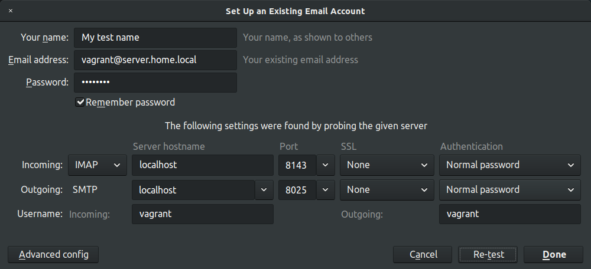
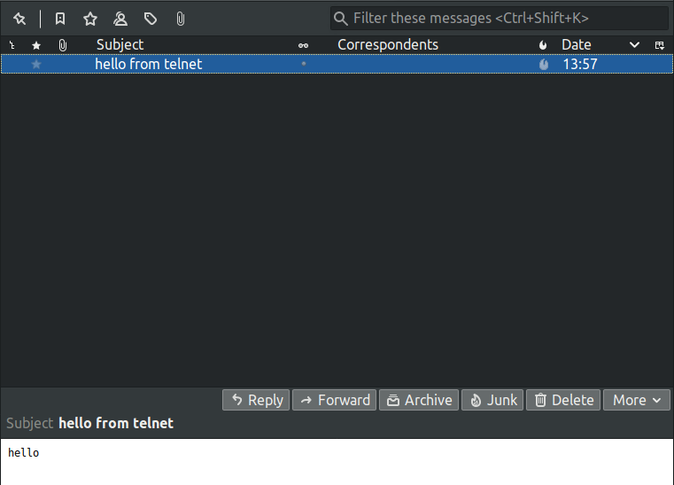

# SMTP, IMAP, POP3

## Homework
почтовый сервер
1. Установить в виртуалке postfix+dovecot для приёма почты на виртуальный домен любым обсужденным на семинаре способом
2. Отправить почту телнетом с хоста на виртуалку
3. Принять почту на хост почтовым клиентом

## Solution
1. Setup environment
    ```bash
    vagrant up
    ```

1. Send email with telnet from localhost
    ```bash
    telnet localhost 8025

    ehlo server.home.local
    mail from: username@example.com
    rcpt to: vagrant@server.home.local
    data
    Subject: hello from telnet
    hello
    .
    ```

1. View inbox via IMAP
    ```bash
    telnet localhost 8143
    a login vagrant password
    b select inbox
    ```

1. Connect with thunderbird

  * settings (password: "password")
  

  * result
  
